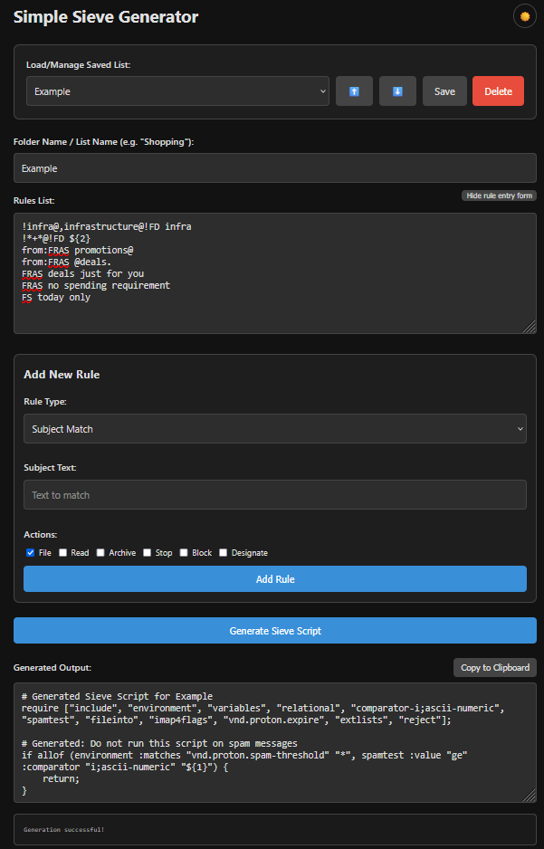

# Simple Sieve Generator

A Cloudflare Worker-based web app to manage Sieve email filtering lists and generate rules.

**Live Demo**: [simple-sieve-generator-demo.devinslick.com](https://simple-sieve-generator-demo.devinslick.com/)  
*(Note: This demo is running in Demo Mode, so saving and deleting lists is disabled.)*

## Features
- **Cloudflare Workers**: Serverless compute.
- **Hono**: Fast, lightweight web framework.
- **Cloudflare KV**: Storage for exclusion lists (Designed to run within the Cloudflare Workers Free Tier).
- **Auto-Deployment**: GitHub Actions workflow included.

## Security (Important!)
This application **does not** include built-in authentication. By default, anyone with the URL can view and edit your Sieve filters.

**Recommendation**: Protect the application using [Cloudflare Zero Trust / Access](https://www.cloudflare.com/products/zero-trust/access/).
1. Go to Cloudflare Zero Trust Dashboard.
2. Create an Application for your Worker's route (e.g., `simple-sieve-generator.your-subdomain.workers.dev`).
3. Set up a policy to allow only your email address.

## Setup

### Prerequisites
- Cloudflare Account
- (Optional) Node.js & npm if you wish to run the project locally

### Local Development

1. Install dependencies:
   ```bash
   cd simple-sieve-generator
   npm install
   ```

2. Start the development server:
   ```bash
   npm run dev
   ```

3. Open your browser at `http://localhost:8787` (or similar).

### Testing

The project includes a test framework for the `/generate` endpoint.

**Running tests locally:**

1. Start the development server in one terminal:
   ```bash
   npm run dev
   ```

2. In another terminal, run the tests:
   ```bash
   npm run test:generate
   ```

**Test options:**
- `--filter=NAME` - Run only tests matching NAME
- `--update-expected` - Update expected output files with actual results

**Adding new tests (autodiscovered):**
1. Create an input file in `tests/generate` named `<test-name>.input` containing your DSL rules. The first non-empty line is used as the test description if it starts with `#`.
2. If desired, create an accompanying `<test-name>.expected` file to assert the generated Sieve output; otherwise run with `--update-expected` to generate it.
3. Run the test runner:
   ```bash
   npm run test:generate
   # or target a single test:
   npm run test:generate -- --filter=my-test
   ```
4. To update expected outputs from the runner use:
   ```bash
   npm run test:generate -- --update-expected
   ```

See `tests/generate/` for example `.input` and `.expected` files demonstrating supported DSL patterns.

### Configuration & Deployment

This project uses GitHub Actions for deployment. All sensitive configuration values (like API tokens and KV IDs) are securely stored in **GitHub Secrets**, not in the source code.

#### 1. Cloudflare API Token
1. Go to the [Cloudflare Dashboard](https://dash.cloudflare.com/profile/api-tokens).
2. Create a Token using the **Edit Cloudflare Workers** template.
3. Copy the token.

#### 2. KV Namespaces
You need to create two KV namespaces (Production and Preview):
1. Go to the **Cloudflare Dashboard** > **Workers & Pages** > **KV**.
2. Click **Create a namespace**. call it `SIEVE_DATA`.
3. Click **Create a namespace** again. Call it `SIEVE_DATA_PREVIEW`.
4. Copy the **ID** for both namespaces.

#### 3. GitHub Secrets
Go to your GitHub Repository **Settings > Secrets and variables > Actions** and add the following Repository Secrets:

| Secret Name | Description |
|-------------|-------------|
| `CLOUDFLARE_API_TOKEN` | Your API Token from step 1. |
| `SIEVE_DATA_ID` | The ID of your production KV namespace. |
| `SIEVE_DATA_PREVIEW_ID` | The ID of your preview KV namespace. |

Once these are set, pushing to the `main` branch will automatically inject these IDs into the configuration and deploy your worker.

### Demo Mode deployment

You can optionally deploy a secondary copy of the application in "Demo Mode", which disables all KV connections and save/load features. This is useful for public demonstrations.

To enable this:
1. Go to your GitHub Repository **Settings > Secrets and variables > Actions**.
2. Click on the **Variables** tab (next to Secrets).
3. Create a **New repository variable**.
   - Name: `ENABLE_DEMO_DEPLOYMENT`
   - Value: `true`
4. The next time the Deploy workflow runs (on push to main), it will also deploy the demo site to a worker named `simple-sieve-generator-demo`.

**Configuration:**
The `wrangler.toml` includes a `[env.demo]` section which sets the `DEMO_MODE` environment variable to `"true"`. The application detects this variable to disable backend features and show a "DEMO MODE" badge in the UI.

### Usage
1. **Access UI**: Visit your deployed URL.
2. **Manage Lists**: Create, Save, and Load rule lists.
3. **Write Rules**: Use the shorthand syntax (see `LEGEND.md`).
4. **Generate**: Click "Generate Sieve Script" to produce the standard Sieve code.
5. **Sync**: Files under `examples/lists` are auto-uploaded on deploy.

### Screenshots
